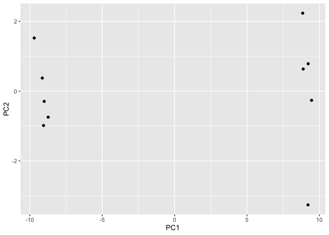

# Class 7: Machine Learning 1
Erica Sanchez (PID:15787505)

Today we will start our multi-part exploration of some key machine
learning methods. We will begin with clusetering - finding groupings in
data, and then dimensionallity reduction.

## Clustering

Let’s start with “k-means” cluster The main function in base R for this
`kmeans()`.

``` r
# Make up some data
hist(rnorm(100000, mean = 3))
```


``` r
tmp <- c(rnorm(30, -3), rnorm(30, +3))
x <- cbind(x=tmp, y=rev(tmp))
plot(x)
```


Now let’s try out `kmeans()`

``` r
km <- kmeans(x, centers=2)
km
```

    K-means clustering with 2 clusters of sizes 30, 30

    Cluster means:
              x         y
    1 -3.012948  2.785205
    2  2.785205 -3.012948

    Clustering vector:
     [1] 1 1 1 1 1 1 1 1 1 1 1 1 1 1 1 1 1 1 1 1 1 1 1 1 1 1 1 1 1 1 2 2 2 2 2 2 2 2
    [39] 2 2 2 2 2 2 2 2 2 2 2 2 2 2 2 2 2 2 2 2 2 2

    Within cluster sum of squares by cluster:
    [1] 47.97307 47.97307
     (between_SS / total_SS =  91.3 %)

    Available components:

    [1] "cluster"      "centers"      "totss"        "withinss"     "tot.withinss"
    [6] "betweenss"    "size"         "iter"         "ifault"      

``` r
attributes(km)
```

    $names
    [1] "cluster"      "centers"      "totss"        "withinss"     "tot.withinss"
    [6] "betweenss"    "size"         "iter"         "ifault"      

    $class
    [1] "kmeans"

> Q. How many points in each cluster?

``` r
km$size
```

    [1] 30 30

> Q. What component of your result object details cluster
> assignment/membership?

``` r
km$cluster
```

     [1] 1 1 1 1 1 1 1 1 1 1 1 1 1 1 1 1 1 1 1 1 1 1 1 1 1 1 1 1 1 1 2 2 2 2 2 2 2 2
    [39] 2 2 2 2 2 2 2 2 2 2 2 2 2 2 2 2 2 2 2 2 2 2

> Q. What are centers/mean values of each cluster?

``` r
km$centers
```

              x         y
    1 -3.012948  2.785205
    2  2.785205 -3.012948

> Q. Make a plot of your data showing your clustering results.

``` r
plot(x, col=km$cluster)
points(km$centers, col="purple", pch=15, cex=3)
```


> Q. Run `kmeans()` again and cluster in 4 groups and plot the results.

``` r
km4 <- kmeans(x, centers=4)
plot(x, col=km4$cluster)
```


## Hierarchical Clustering

This form of clustering aims to reveal the structure in your data by
progressively grouping points into a ever smaller number of clusters.

The main function in base R for this is called `hclust()`. This function
does not take our input data directly but wants a “distance matrix” that
details how (dis)similar all our input points are to each other.

``` r
hc <- hclust( dist(x) )
hc
```


    Call:
    hclust(d = dist(x))

    Cluster method   : complete 
    Distance         : euclidean 
    Number of objects: 60 

The print out above is not very useful (unlike that from kmeans) but
there is a useful `plot()` method.

``` r
plot(hc)
abline(h=10, col="red")
```


To get my main result (my cluster membership vector) I need to “cut” my
tree using the function `cutree()`

``` r
grps <- cutree(hc, h=10)
grps
```

     [1] 1 1 1 1 1 1 1 1 1 1 1 1 1 1 1 1 1 1 1 1 1 1 1 1 1 1 1 1 1 1 2 2 2 2 2 2 2 2
    [39] 2 2 2 2 2 2 2 2 2 2 2 2 2 2 2 2 2 2 2 2 2 2

``` r
plot(x, col=grps)
```


``` r
plot(x, col=cutree(hc, h=6))
```


# Principal Component Analysis (PCA)

The goal of PCA is to reduce the dimensionality of a dataset down to
some smaller subset of new variables (called PCs) that are useful bases
for further analysis, like visualization, clustering, etc.

``` r
url <- "https://tinyurl.com/UK-foods"
x <- read.csv(url, row.names=1)
x
```

                        England Wales Scotland N.Ireland
    Cheese                  105   103      103        66
    Carcass_meat            245   227      242       267
    Other_meat              685   803      750       586
    Fish                    147   160      122        93
    Fats_and_oils           193   235      184       209
    Sugars                  156   175      147       139
    Fresh_potatoes          720   874      566      1033
    Fresh_Veg               253   265      171       143
    Other_Veg               488   570      418       355
    Processed_potatoes      198   203      220       187
    Processed_Veg           360   365      337       334
    Fresh_fruit            1102  1137      957       674
    Cereals                1472  1582     1462      1494
    Beverages                57    73       53        47
    Soft_drinks            1374  1256     1572      1506
    Alcoholic_drinks        375   475      458       135
    Confectionery            54    64       62        41

> Q1. How many rows and columns are in your new data frame named x? What
> R functions could you use to answer this questions?

``` r
dim(x)
```

    [1] 17  4

# Preview the first 6 rows

``` r
rownames(x) <- x[,1]
x <- x[,-1]
head(x)
```

        Wales Scotland N.Ireland
    105   103      103        66
    245   227      242       267
    685   803      750       586
    147   160      122        93
    193   235      184       209
    156   175      147       139

``` r
head(x)
```

        Wales Scotland N.Ireland
    105   103      103        66
    245   227      242       267
    685   803      750       586
    147   160      122        93
    193   235      184       209
    156   175      147       139

> Q2. Which approach to solving the ‘row-names problem’ mentioned above
> do you prefer and why? Is one approach more robust than another under
> certain circumstances?

I prefer using x \<- read.csv(url, row.names=1) because it looks cleaner
to have the column removed while it’s being read. Using the “rownames()”
approach will remove the first unamed column each time, so it could lead
to issues when analyzing data.

> Q3: Changing what optional argument in the below barplot() function
> results in the following plot?

``` r
barplot(as.matrix(x), beside=T, col=rainbow(nrow(x)))
```


``` r
barplot(as.matrix(x), col=rainbow(nrow(x)))
```


The so-called “pairs” plot can be useful for small datasets:

``` r
pairs(x, col=rainbow(nrow(x)))
```


> Q5: Generating all pairwise plots may help somewhat. Can you make
> sense of the following code and resulting figure? What does it mean if
> a given point lies on the diagonal for a given plot?

``` r
pairs(x, col=rainbow(10), pch=16)
```


If a point lies on the diagonal line for a given plot, then the points
have identical values.

> Q6. What is the main differences between N. Ireland and the other
> countries of the UK in terms of this data-set?

They do not follow the diaganol line as much as the other countries of
the UK.

So the pairs plot is useful for small datasets but it can be lots of
work to intercept and gets untraceable for larger datasets.

So PCA to the rescue…

The main function to do PCA in base R is called `prcomp()`. This
function wants the transpose of our data in this case.

``` r
pca <- prcomp(t(x))
summary(pca)
```

    Importance of components:
                                PC1      PC2       PC3
    Standard deviation     379.8991 260.5533 1.459e-13
    Proportion of Variance   0.6801   0.3199 0.000e+00
    Cumulative Proportion    0.6801   1.0000 1.000e+00

``` r
attributes(pca)
```

    $names
    [1] "sdev"     "rotation" "center"   "scale"    "x"       

    $class
    [1] "prcomp"

``` r
pca$x
```

                    PC1        PC2           PC3
    Wales     -288.9534  226.36855  1.348366e-14
    Scotland  -141.3603 -284.81172  4.627961e-13
    N.Ireland  430.3137   58.44317 -1.280793e-13

A major PCA result viz is called a “PCA plot” (aka a score plot, biplot,
PC1 vs PC2 plot, ordination plot)

> Q7. Complete the code to generate a plot of PC1 vs PC2.

> Q8. Customize your plot so that the colors of the country names match
> the colors in our UK and Ireland map and table at start of this
> document.

``` r
# Plot PC1 vs PC2
mycols <- c("orange", "red", "blue", "darkgreen")
plot(pca$x[,1], pca$x[,2], col=mycols, pch=16,
     xlab="PC1", ylab="PC2")
abline(h=0, col="gray")
abline(v=0, col="gray")
```


Another important output from PCA is called “loadings” vector or the
“rotation” componenet - this tells us how much the original variables
(the foods in this case) contribute to the new PCs.

``` r
pca$rotation
```

                 PC1          PC2          PC3
    105  -0.05515951 -0.015926208 -0.114785683
    245   0.05228588 -0.014247351  0.090388866
    685  -0.29754711  0.017770827 -0.140679146
    147  -0.08127351  0.050871661 -0.032506892
    193  -0.01378426  0.095789177 -0.088241699
    156  -0.03995614  0.043238659  0.060855246
    720   0.38787509  0.714518360 -0.199098947
    253  -0.13584223  0.144666425 -0.055102719
    488  -0.24608178  0.226299860 -0.251953979
    198  -0.03217825 -0.042547197 -0.091526858
    360  -0.03250215  0.045390849  0.138275463
    1102 -0.60208698  0.178285653  0.105684388
    1472 -0.07242201  0.213840430 -0.673357649
    57   -0.02896604  0.030761774  0.005505441
    1374  0.21794320 -0.555250465 -0.560188267
    375  -0.49854565 -0.110688746 -0.184979763
    54   -0.03330887 -0.005704759  0.004859328

PCA looks to be a super useful method for gaining some insight into high
dimensional data that is difficult to examine in other ways.

# PCA of RNASeq data

``` r
url2 <- "https://tinyurl.com/expression-CSV"
rna.data <- read.csv(url2, row.names=1)
head(rna.data)
```

           wt1 wt2  wt3  wt4 wt5 ko1 ko2 ko3 ko4 ko5
    gene1  439 458  408  429 420  90  88  86  90  93
    gene2  219 200  204  210 187 427 423 434 433 426
    gene3 1006 989 1030 1017 973 252 237 238 226 210
    gene4  783 792  829  856 760 849 856 835 885 894
    gene5  181 249  204  244 225 277 305 272 270 279
    gene6  460 502  491  491 493 612 594 577 618 638

``` r
## Again we have to take the transpose of our data 
pca <- prcomp(t(rna.data), scale=TRUE)
```

``` r
summary(pca)
```

    Importance of components:
                              PC1    PC2     PC3     PC4     PC5     PC6     PC7
    Standard deviation     9.6237 1.5198 1.05787 1.05203 0.88062 0.82545 0.80111
    Proportion of Variance 0.9262 0.0231 0.01119 0.01107 0.00775 0.00681 0.00642
    Cumulative Proportion  0.9262 0.9493 0.96045 0.97152 0.97928 0.98609 0.99251
                               PC8     PC9      PC10
    Standard deviation     0.62065 0.60342 3.345e-15
    Proportion of Variance 0.00385 0.00364 0.000e+00
    Cumulative Proportion  0.99636 1.00000 1.000e+00

> Q. How many genes in this dataset?

``` r
nrow(rna.data)
```

    [1] 100

``` r
attributes(pca)
```

    $names
    [1] "sdev"     "rotation" "center"   "scale"    "x"       

    $class
    [1] "prcomp"

``` r
head(pca$x)
```

              PC1        PC2        PC3        PC4        PC5        PC6
    wt1 -9.697374  1.5233313 -0.2753567  0.7322391 -0.6749398  1.1823860
    wt2 -9.138950  0.3748504  1.0867958 -1.9461655  0.7571209 -0.4369228
    wt3 -9.054263 -0.9855163  0.4152966  1.4166028  0.5835918  0.6937236
    wt4 -8.731483 -0.7468371  0.5875748  0.2268129 -1.5404775 -1.2723618
    wt5 -9.006312 -0.2945307 -1.8498101 -0.4303812  0.8666124 -0.2496025
    ko1  8.846999  2.2345475 -0.1462750 -1.1544333 -0.6947862  0.7128021
                PC7         PC8         PC9         PC10
    wt1 -0.24446614  1.03519396  0.07010231 3.388516e-15
    wt2 -0.03275370  0.26622249  0.72780448 2.996563e-15
    wt3 -0.03578383 -1.05851494  0.52979799 3.329630e-15
    wt4 -0.52795595 -0.20995085 -0.50325679 3.317526e-15
    wt5  0.83227047 -0.05891489 -0.81258430 2.712504e-15
    ko1 -0.07864392 -0.94652648 -0.24613776 2.768138e-15

I will make a main result figure use ggplot:

``` r
library(ggplot2)
```

``` r
res <- as.data.frame(pca$x)
```

``` r
mycols <- c(rep("blue", 5), rep("red",5))
mycols
```

     [1] "blue" "blue" "blue" "blue" "blue" "red"  "red"  "red"  "red"  "red" 

``` r
ggplot(res) +
  aes(PC1, PC2, label=row.names(res)) +
  geom_label()
```


``` r
colnames(rna.data)
```

     [1] "wt1" "wt2" "wt3" "wt4" "wt5" "ko1" "ko2" "ko3" "ko4" "ko5"

``` r
res <- as.data.frame(pca$x)
```

``` r
mycols <- c(rep("blue", 5), rep("red",5))
mycols
```

     [1] "blue" "blue" "blue" "blue" "blue" "red"  "red"  "red"  "red"  "red" 

``` r
ggplot(res) +
  aes(PC1, PC2, label=row.names(res)) +
  geom_point()
```



``` r
kmeans(pca$x[,1], centers=2)
```

    K-means clustering with 2 clusters of sizes 5, 5

    Cluster means:
           [,1]
    1  9.125676
    2 -9.125676

    Clustering vector:
    wt1 wt2 wt3 wt4 wt5 ko1 ko2 ko3 ko4 ko5 
      2   2   2   2   2   1   1   1   1   1 

    Within cluster sum of squares by cluster:
    [1] 0.2648467 0.5017505
     (between_SS / total_SS =  99.9 %)

    Available components:

    [1] "cluster"      "centers"      "totss"        "withinss"     "tot.withinss"
    [6] "betweenss"    "size"         "iter"         "ifault"      
